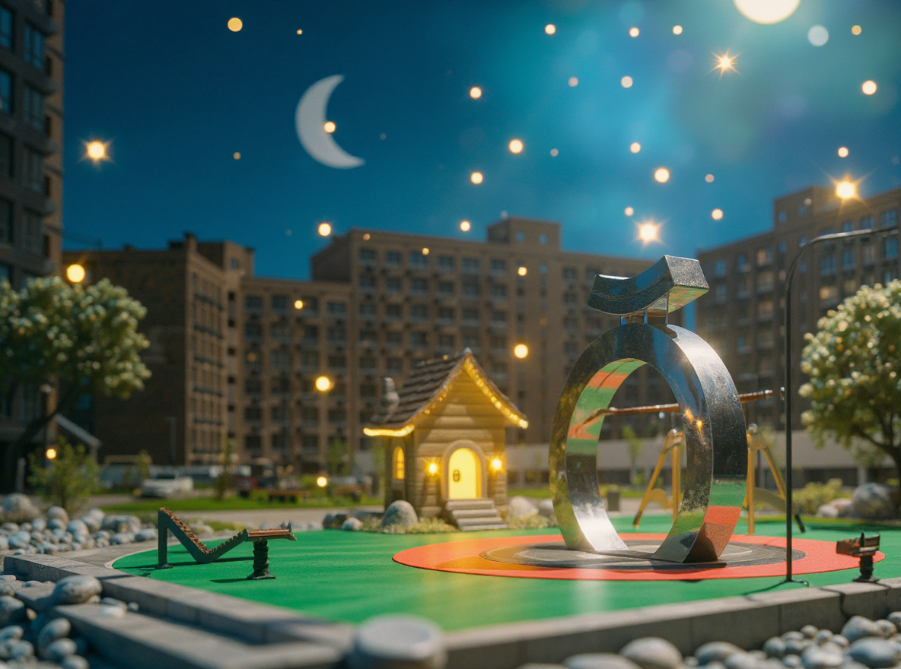

Собрал серию рекламных материалов для заметной городской кампании: от key visuals до транспорта и CGI-подачи проекта.

## Задача

Нужно было сделать визуальную коммуникацию для объекта заметной в конкурентной городской среде. Ставка была на агрессивный визуальный жест, который можно перенести и на outdoor, и на брендированный транспорт.

## Что сделано

- рекламный hero visual
- bus/mockup-адаптация для городской среды
- серия поддерживающих CGI-кадров
- набор презентационных материалов и layout-правил

## Подход

Система строится на контрасте между гиперболизированным кадром, жестким crop и лаконичной типографикой. Такой подход делает даже утилитарные носители визуально сильными.

## Результат

Получилась цельная рекламная система, которая уверенно работает в городском контексте и на презентации. Проект выглядит не как локальная реклама, а как полноценная визуальная кампания.
