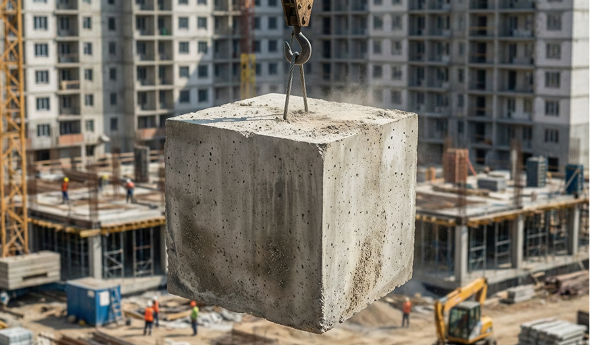

Собрал визуальную систему запуска для девелоперского проекта: от hero-кадров и презентационных слайдов до имиджевых digital-носителей.

## Задача

Нужно было оформить жилой комплекс как современный городской продукт, а не как стандартную риелторскую рекламу. Важной задачей было соединить архитектурную подачу, ритм типографики и ощущение премиального образа жизни.

## Что сделано

- hero key visual для запуска
- графика для digital-кампании и перформанс-баннеров
- серия презентационных слайдов и pitch-материалов
- визуальные правила по масштабу, ритму и crop-системе

## Подход

Я построил подачу вокруг резкой перспективы, плотных цветовых акцентов и крупной архитектурной массы в кадре. Вместо шаблонных рендеров акцент сделан на визуальном напряжении и сильной композиции.

## Результат

Кампания выглядит собранной и масштабируемой: визуалы работают и как image-based реклама, и как презентационный язык проекта. В результате коммуникация стала заметно более узнаваемой и дорогой по тону.
