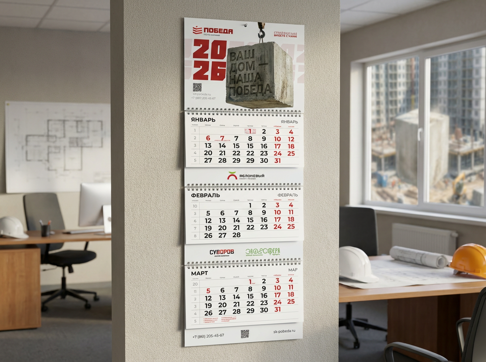
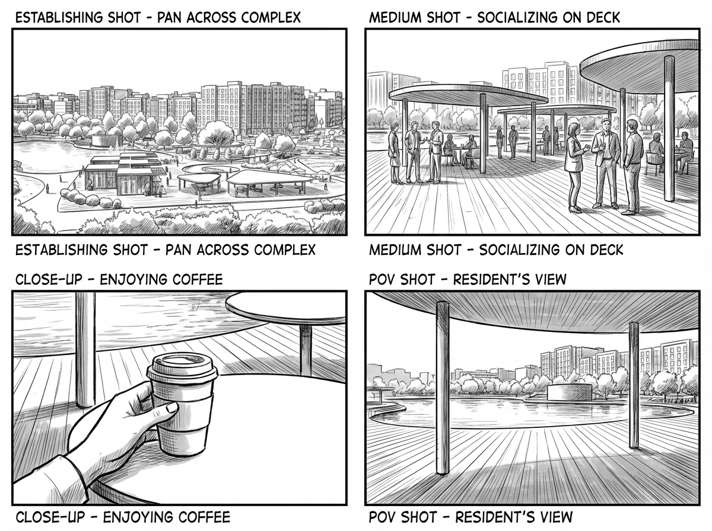

Сфокусировался на сетке, темпе разворотов и графическом контрасте, чтобы материал читался как собранный номер, а не блог-лента.

## Задача

Нужно было оформить пилотный выпуск как цельный editorial-объект, а не просто как набор статей на сайте. Важной задачей было удержать ощущение печатного ритма в цифровой среде.

## Что сделано

- дизайн разворотов и титульных блоков
- система модульной сетки для длинных материалов
- набор обложек и внутренних постерных кадров
- презентационные слайды для редакционной концепции
- набор шаблонов для анонсов и социальных публикаций

## Подход

Я работал через ритм: плотные текстовые блоки чередуются с широкими визуальными паузами, а типографика задает ощущение выпуска. Графический язык построен так, чтобы фото, цитаты и подписи складывались в единую последовательность.

## Результат

Пилот получился собранным и взрослым по подаче. Визуальная система помогает воспринимать материал как curated issue, а не как поток контента.
