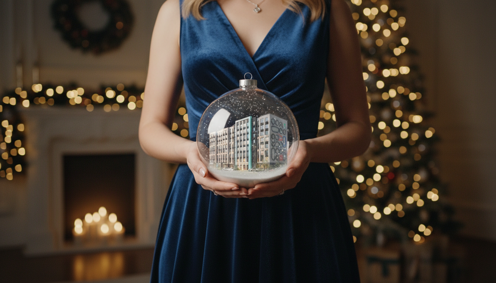
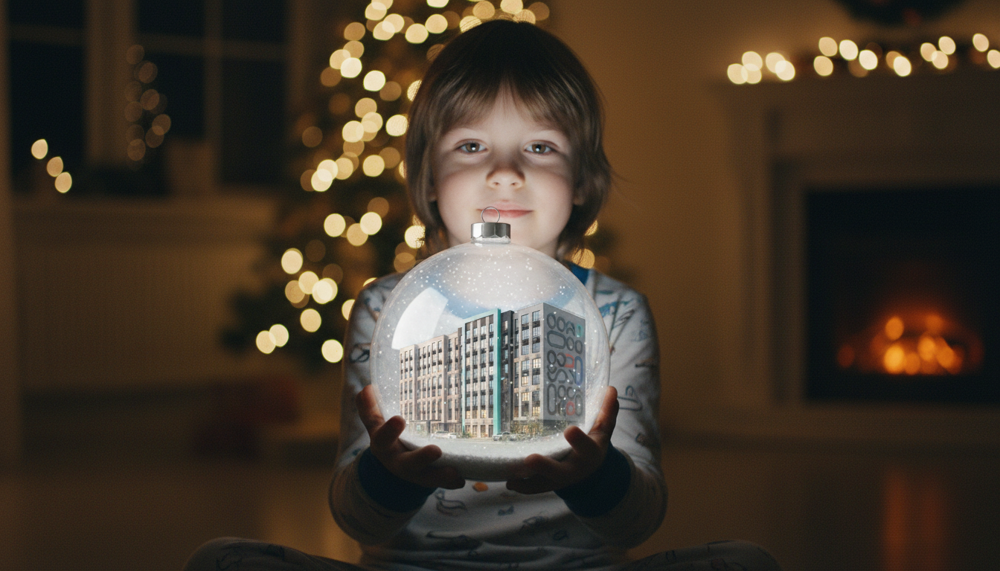

Собрал праздничную коммуникацию как единую визуальную серию: hero-кадр, вариативные портреты и digital-материалы для анонса события.

## Задача

Нужно было сделать сезонную кампанию праздничной, но не перегруженной декоративными клише. Основная задача состояла в том, чтобы сохранить атмосферу события и при этом сделать материалы пригодными для digital-rollout.

## Что сделано

- key visual кампании
- серия персонажных вариаций для digital-носителей
- набор social media visuals для анонса и прогрева
- презентационные кадры для pitch и партнерских материалов

## Подход

Я использовал театральную постановку кадра и ограниченную палитру акцентных цветов, чтобы материалы выглядели дорого и собранно. Вся серия строится на узнаваемой фронтальной композиции и четком масштабе предмета в руках персонажа.

## Результат

Кампания получилась визуально цельной: разные персонажи работают как части одной системы, а материалы легко раскладываются на посты, stories и event-носители.
