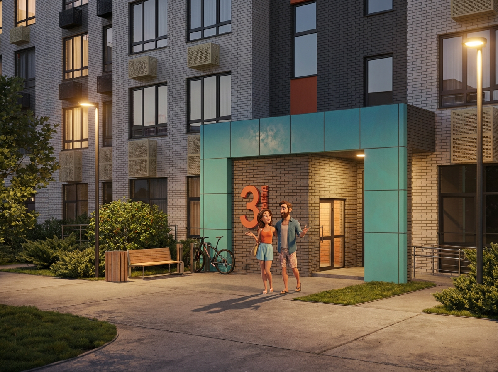

Проект собран как серия легких, запоминающихся digital-материалов для сезонной коммуникации: от CGI-кадров до playful visual assets.

## Задача

Нужно было сделать компактную визуальную систему для зимнего digital-запуска, в которой можно свободно сочетать персонажей, объектные кадры и pseudo-CGI сценки. Главный критерий: материалы должны быть быстрыми, дружелюбными и хорошо работать в social.

## Что сделано

- CGI-support кадры
- серия character-based posts
- набор social assets под вертикальные и квадратные форматы
- простые правила по цвету, композиции и масштабу объектов

## Подход

Визуальный язык строится на мягком юморе, предметной крупности и чистом фокусе на одном действии в кадре. Такой принцип помогает быстро считывать сообщение даже в коротких и плотных медиа-форматах.

## Результат

Серия получилась легкой и живой, но при этом контролируемой по стилю. Ее можно масштабировать в stories, reels previews и статичные post-форматы без потери общего характера.
